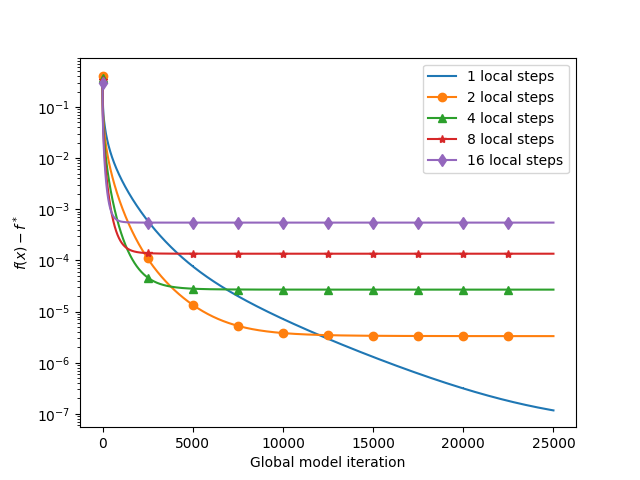
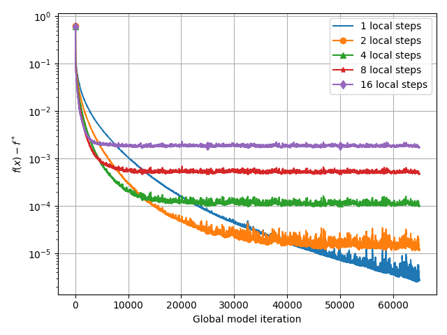

# Federated Learning Simulator (FLSim) — The QAFeL Fork

This is a fork of the [FLSim](https://github.com/facebookresearch/FLSim) library. 
It is used for the [QAFeL](https://arxiv.org/abs/2410.00242) algorithm experiments.

For most information, please see the [FLSim](https://github.com/facebookresearch/FLSim) README.

## CelebA and CIFAR experiments
For the experiments scripts and results, see folder `paper_experiments/`.
The used configurations are in the corresponding `configs/` folders.
All the runs are available, and can be analyzed with Tensorboard.
The console output was also stored in the accompanying .txt files.

To reproduce a desired configuration, run the `helper.sh` script with the desired configuration as argument.

The iteration at which every run achieves the desired accuracy is stored in the .xlsx files in the `paper_experiments/` folder, which also contains the appendix plots.

For the main body plot, run the `IEEEPlotFigConvergence.ipybn` notebook.


## Logistic Regression experiments
For the experiments scripts and results, navigate to folder `logistic_regression/`.

The results are stored in the `results/` folder, as well as the plots.

An auxiliary script `plot_logistic_regression.py` is provided to plot the results.

For a comparison with FedAVG, run `logistic_regression_averaging.py`, which gives analogous results for the synchronous case.
The results for the synchronous case, shown in the image below, are the same as Fig. 6 in [Tighter Theory for Local SGD on Identical and Heterogeneous Data](https://proceedings.mlr.press/v108/bayoumi20a.html).


The analogous results for the asynchronous case are in the figure below. For stability, the model was trained for 2.6 x more steps, and the learning rate was decreased. Note however, that each global model iteration in the asynchronous case only waits to receive 10 client updates, instead of the 100 in the synchronous case. Thus, the asynchronous case is notably faster in terms of wall-clock time in practice.


To obtain the QAFeL vs Naive quantization comparison plots, please run `QAFeLvsNaiveQSGD.py` and `QAFeLvsNaiveTopK.py`.

For a general run, run `python experiment_main.py` with the desired configuration. See the help message below for the available options.

```bash 
usage: experiment_main.py [-h] [--helpfull] [--verbose] [--seed SEED] [--algorithm_type ALGORITHM_TYPE]
                          [--client_quantizer_type CLIENT_QUANTIZER_TYPE] [--client_quantizer_value CLIENT_QUANTIZER_VALUE]
                          [--server_quantizer_type SERVER_QUANTIZER_TYPE] [--server_quantizer_value SERVER_QUANTIZER_VALUE]
                          [--n_clients N_CLIENTS] [--n_local_steps N_LOCAL_STEPS] [--client_lr CLIENT_LR] [--n_global_steps N_GLOBAL_STEPS]
                          [--server_buffer_size SERVER_BUFFER_SIZE] [--server_lr SERVER_LR] [--results_folder RESULTS_FOLDER]
                          [--baseline_loss BASELINE_LOSS] [--test_run]

options:
  -h, --help            show this help message and exit
  --helpfull            show full help message and exit
  --verbose, -V         Plot progress and metrics after training. (default: False)
  --seed SEED
  --algorithm_type ALGORITHM_TYPE
                        Type of algorithm to use, one of 'QAFeL|Naive|FedBuff' (default: QAFeL)
  --client_quantizer_type CLIENT_QUANTIZER_TYPE
                        Type of quantizer to use for the client, one of 'qsgd|top_k' (default: qsgd)
  --client_quantizer_value CLIENT_QUANTIZER_VALUE
                        Value of the quantizer to use for the client (levels for qsgd, percentage of coordinates for top_k) (default: 65536)    
  --server_quantizer_type SERVER_QUANTIZER_TYPE
                        Type of quantizer to use for the server, one of 'qsgd|top_k' (default: qsgd)
  --server_quantizer_value SERVER_QUANTIZER_VALUE
                        Value of the quantizer to use for the server (levels for qsgd, percentage of coordinates for top_k) (default: 65536)    
  --n_clients N_CLIENTS
                        Number of clients to use for the experiment (default: 100)
  --n_local_steps N_LOCAL_STEPS
                        Number of local steps to use for the experiment (default: 10)
  --client_lr CLIENT_LR
                        Learning rate for the client (default: 2)
  --n_global_steps N_GLOBAL_STEPS
                        Number of global steps to use for the experiment (default: 10000)
  --server_buffer_size SERVER_BUFFER_SIZE
                        Size of the server buffer to use for the experiment (default: 10)
  --server_lr SERVER_LR
                        Learning rate for the server (default: 0.1)
  --results_folder RESULTS_FOLDER
                        Folder to save the results of the experiment (default: ./results)
  --baseline_loss BASELINE_LOSS
                        Baseline loss for the experiment (default: 0.014484174216922262)
  --test_run            Whether to run a test run of the experiment (default: False)
```

# Citing

If you use any of these codes, please cite the following papers:

```
@article{ortega2023asynchronous,
  title={Asynchronous Federated Learning with Bidirectional Quantized Communications and Buffered Aggregation},
  author={Ortega, Tomas and Jafarkhani, Hamid},
  journal={arXiv preprint arXiv:2308.00263},
  year={2023}
}
```

and

```
@article{ortega2024quantized,
  title={Quantized and Asynchronous Federated Learning},
  author={Ortega, Tomas and Jafarkhani, Hamid},
  journal={IEEE Transactions on Communications},
  year={2024},
  publisher={IEEE}
}
```
FLSim is scalable and fast. It supports differential privacy (DP), secure aggregation (secAgg), and a variety of compression techniques.

In FL, a model is trained collaboratively by multiple clients that each have their own local data, and a central server moderates training, e.g. by aggregating model updates from multiple clients.

In FLSim, developers only need to define a dataset, model, and metrics reporter. All other aspects of FL training are handled internally by the FLSim core library.
